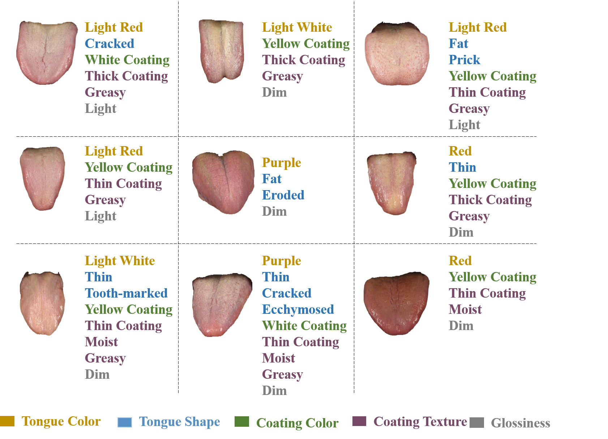
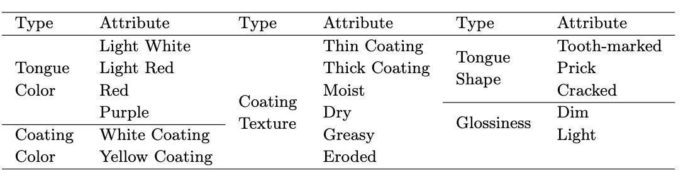

# TMA (For tongue multi-attribute classification)

Currently, there is no publicly available dataset with annotated multi-attribute of tongue images. To fill this gap, we construct a dataset called TMA as a benchmark for this task. The tongue images, collected with consistent light source, a color temperature of $5600K$ and high resolution, are provided by School of TCM. Tongue attribute labels are annotated by experienced expert TCM practitioners. Several examples in TMA are displayed:

**Data amount:** A total number of $500$ tongue images were annotated from five aspects. To enhance the performance of the model, data augmentation was performed using random horizontal flipping, rotation and reflection to increase the number of images. Finally, a total number of $5000$ tongue images is generated and we use $4000$ images as training data, $500$ images as validating data and evaluate all methods on a test set consisting of $500$ images.

**Image Preprocessing:** Tongue segmentation should be used to eliminate irrelevant objects (such as lips and teeth) and environmental background information, which can increase the accuracy of the classification and reduce the amount of calculation. We use SAM model to crop the tongue object. The original image size is $2592 \times 1944$, and the image is resized to $H \times W = 448 \times 448$ after cropping for meeting the input requirements of the backbone.

# Contact
To protect patient privacy, our dataset is obtained through formal application. Please send an email to 22349023@suibe.edu.cn for the application.
